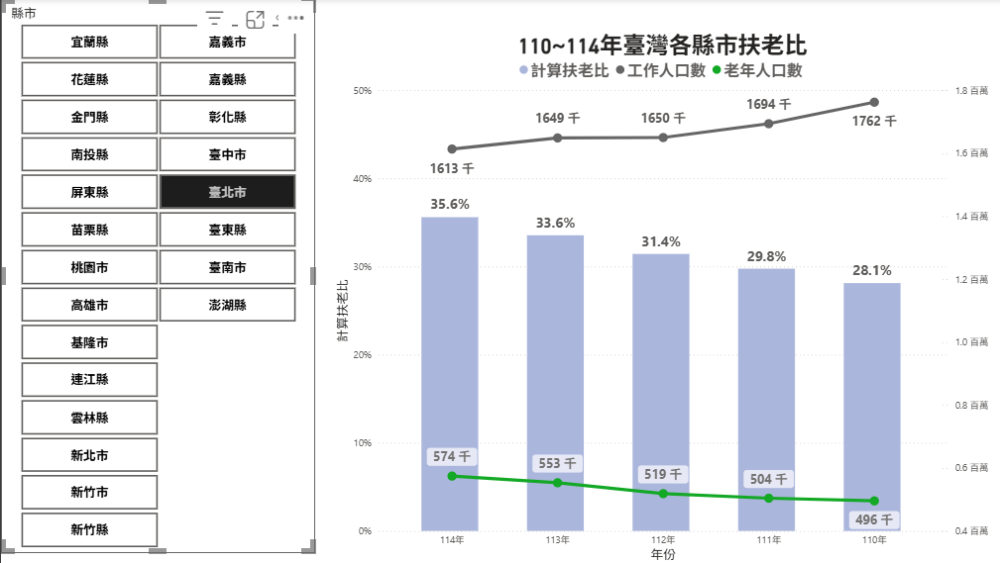
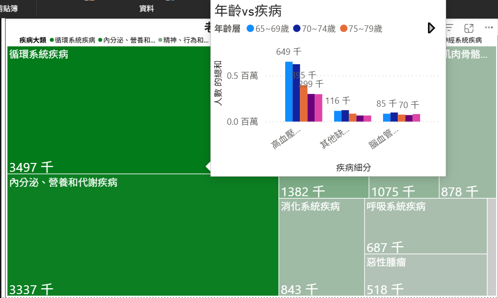
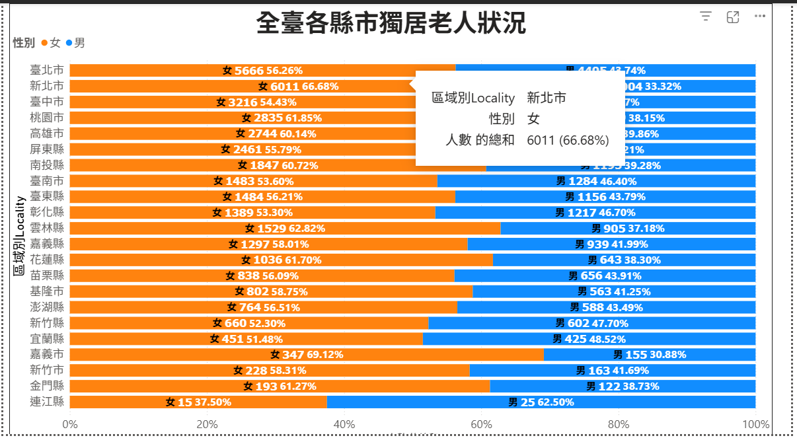
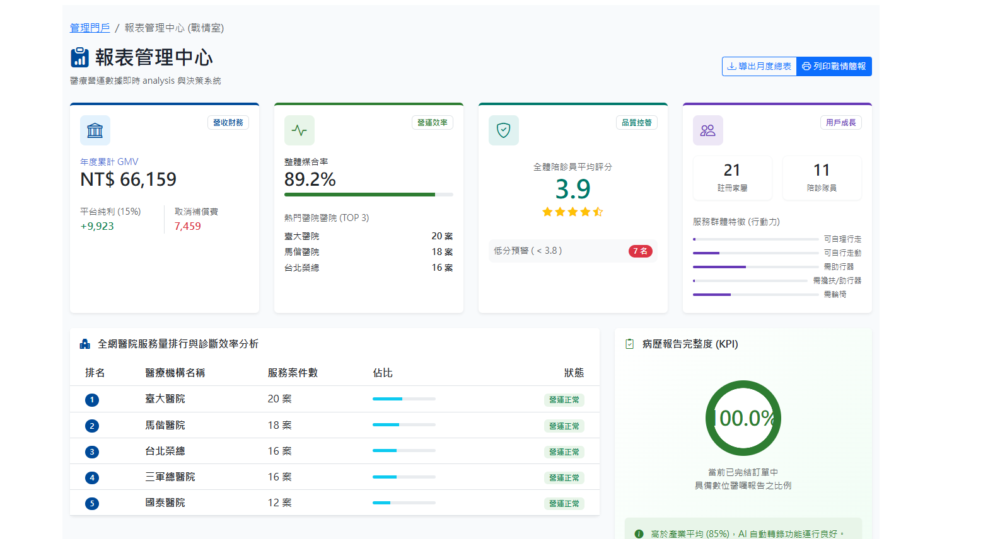
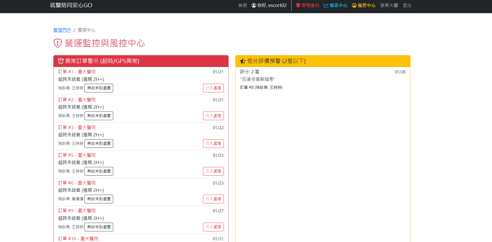
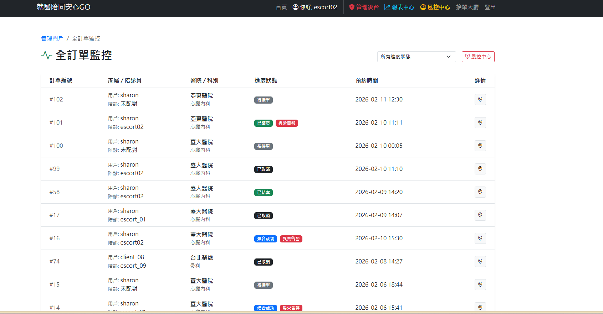
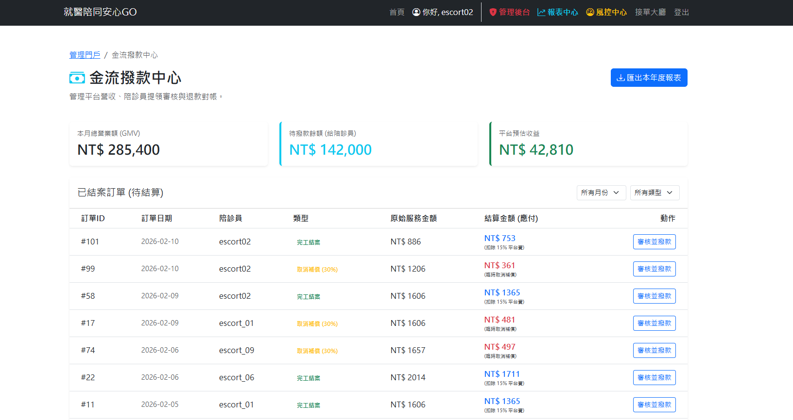
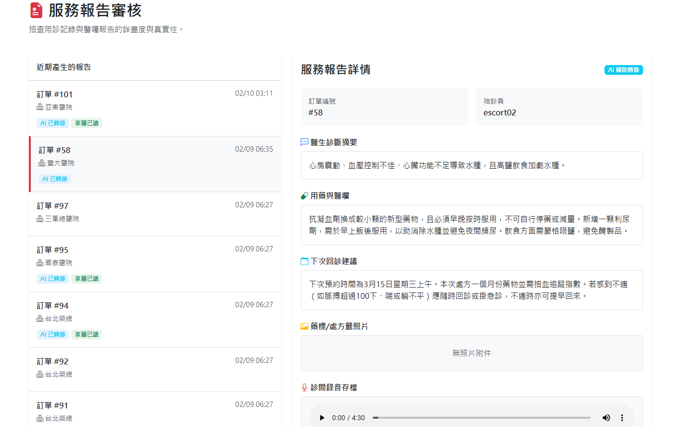
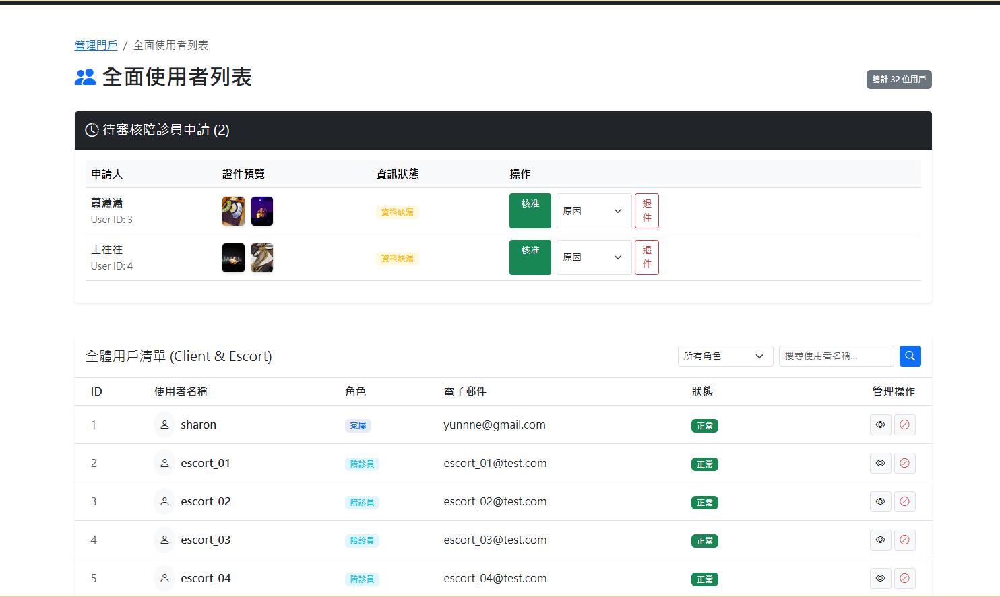

# MedicalEscortGO-Showcase
# 🏥 就醫陪同安心GO (MedicalEscortGO)

> **專為高齡就醫設計的智能陪診預約平台**
> 結合 AI 原生語音解析技術，打破醫療溝通障礙，並透過嚴謹的業務邏輯保障醫、患、陪三方權益。

---

### 📑 專案深度解析簡報 (PPT)
> 💡 **提示**：點擊下方連結，即可直接於瀏覽器內觀看完整專案架構與開發思維簡報。

**👉 [📥 點擊觀看：就醫陪同安心GO 完整專案簡報 (PDF)](https://github.com/yunne-tech/MedicalEscortGO-Showcase/blob/main/MedicalEscortGOPlatform.pdf)**

---

## 🚀 專案亮點 (Highlights)

* **AI 原生聽覺技術**：採用 **Gemini 1.5 Pro** 原生音訊處理，精準解析國、台、英多語混雜診間對話，並輸出 JSON 結構化報告。
* **高內聚低耦合架構**：後端採用 **Python Flask Blueprint** 設計，清晰隔離「使用者、陪診員、管理端」邏輯。
* **嚴謹預約控制**：實作排程防撞機制、併發控制與動態退費風控策略。

---

## 🛠 技術棧 (Tech Stack)

* **Frontend**: HTML5, CSS3, JavaScript (手工打造卡片式介面與微陰影設計)。
* **Backend**: Python Flask (Blueprint 模組化開發)。
* **Database**: SQLite (Zero-Config 高效部署)。
* **Data Analytics**: Power BI (營運指標視覺化分析)。

---

## 📊 系統架構與業務流程

本系統涵蓋「預約者、陪診員、平台端」三方實體之複雜關聯與自動化流轉。

  
*(💡 點擊此處查看 [Whimsical 高畫質互動式心智圖](https://whimsical.com/web-P5xQPEYEEU9GR2dnYufhHp))*

---
## 🔍 市場需求與高齡化趨勢分析

在開發本系統前，我針對台灣人口老化現況進行了深度數據研究，確保系統功能精準切中社會需求痛點。

### 1. 110~114年台灣人口老化趨勢
隨著醫療進步與少子化，台灣已步入超高齡社會(突破25%)，高齡人口比例逐年攀升。

### 2. 110~114年臺灣各縣市扶老比
分析數據顯示，各縣市扶老比持續升高，青壯年照顧壓力劇增，印證了「第三方陪診服務」的必要性。

### 3. 老年人慢性病現狀
高達八成以上的高齡者患有至少一種慢性病，且回診頻率高，衍生出龐大的就醫接送與診間溝通需求。

### 4. 獨居老年人口各縣市概況
獨居老人比例在特定縣市顯著較高，這群「老老照顧」或「無人照顧」的群體是本系統最核心的服務對象，其中新北市為第一，。

---
## 💡 技術挑戰與解法 (Technical Highlights)

### 1. 三方權限隔離與角色存取控制 (RBAC)
* **挑戰**：多角色併行，需防止非授權存取敏感營運報表。
* **解法**：運用 Flask Blueprint 實作邏輯隔離，並透過自定義裝飾器 (Decorators) 確保僅管理員能進入風控中心。

### 2. 預約防衝突機制 (Collision Prevention)
* **挑戰**：醫療服務具排他性，需確保單一陪診員時段絕不重疊。
* **解法**：在資料庫層級實作時段檢查，自動阻斷已過期時段及重疊下單之行為。

### 3. 動態風控退費邏輯
* **挑戰**：平衡陪診員排班成本與預約者取消之彈性。
* **解法**：實作「3 小時門檻規則」，針對服務前 3 小時內取消之已媒合訂單，系統自動扣除 30% 違約金。

---

## 🤖 核心技術：破除醫療語言藩籬的 AI 實作

針對診間嘈雜、醫學術語辨識率低的痛點，直接串接 **Gemini 1.5 Pro 原生音訊 API**。

* **多語辨識**：精準捕捉國台英夾雜對話。
* **結構化萃取**：強制輸出 JSON，讓非結構化語音直接轉化為可寫入資料庫的高質量數據。

---

## 🛡️ 平台管理後台 (Admin Portal)：數據驅動與自動化營運

為了支撐龐大的雙邊市場 (家屬與陪診員) 運作，本系統針對平台管理員 (Admin) 開發了全方位的後台管理門戶，涵蓋數據戰情、風控警示、金流自動結算與醫療報告稽核。

### 1. 📊 報表管理中心 (戰情室 Dashboard)
> **將營運數據轉化為決策資本**

即時視覺化平台核心 KPI，包含本月總營業額 (GMV)、訂單整體媒合率 (89.2%)、各醫院服務量排名，以及用戶群體特徵分析。並追蹤「病歷報告完整度」，確保 AI 轉錄功能穩定運行。

### 2. 🚨 風控中心與全訂單監控 (Risk Control & Monitoring)
> **自動化防護網，保障服務品質與平台聲譽**

* **全局狀態追蹤**：一覽所有訂單的生命週期（待接單、媒合成功、異常告警、已取消）。
* **自動異常觸發機制**：系統會針對「超時未結案 (逾期 2H+)」及「低分評價 (2星以下)」自動產生警示報表，強制營運人員介入處理，降低潛在的客訴與醫療糾紛風險。

### 3. 💰 智能金流撥款中心 (Financial Settlement)
> **結合訂單狀態機的動態計費系統**

擺脫人工對帳，系統根據訂單最終狀態自動執行分潤邏輯：
* **常規結算**：完工結案訂單自動扣除 15% 平台維運費。
* **動態風控防護**：針對達到違約條件的取消訂單，系統自動計算並提撥 30% 取消補償金給陪診員，保障勞方權益與平台金流健康。

### 4. 🏥 AI 服務報告審核 (Medical Report Audit)
> **人機協作 (Human-in-the-Loop) 的醫療紀錄品管**

結合 Gemini 1.5 Pro 的 AI 語音轉錄結果，管理員可在此介面進行雙重覆核。核對「語音存檔、處方籤照片」與 AI 生成的「醫囑摘要、用藥建議」是否一致，確保交付給家屬的醫療資訊具備 100% 的準確度。

### 5. 👥 全面使用者與 KYC 管理 (User Management)
> **嚴格的端點准入機制**

統一管理 Client (家屬) 與 Escort (陪診員) 雙邊帳號。針對陪診員端實作嚴謹的 KYC (Know Your Customer) 流程，管理員可在此預覽上傳的專業證件並執行核准/退件操作，從源頭把關服務品質。

---

> 🔒 **Security Note**: 
> 為保護核心商業邏輯（包含風控演算法與資料庫細節），**後端 Python 原始碼已獨立存放於 Private Repository**。十分樂意於面試時透過螢幕分享展示完整代碼細節。
