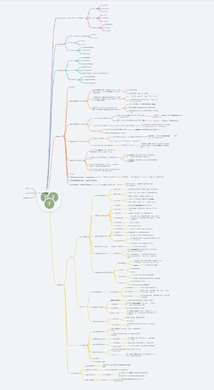
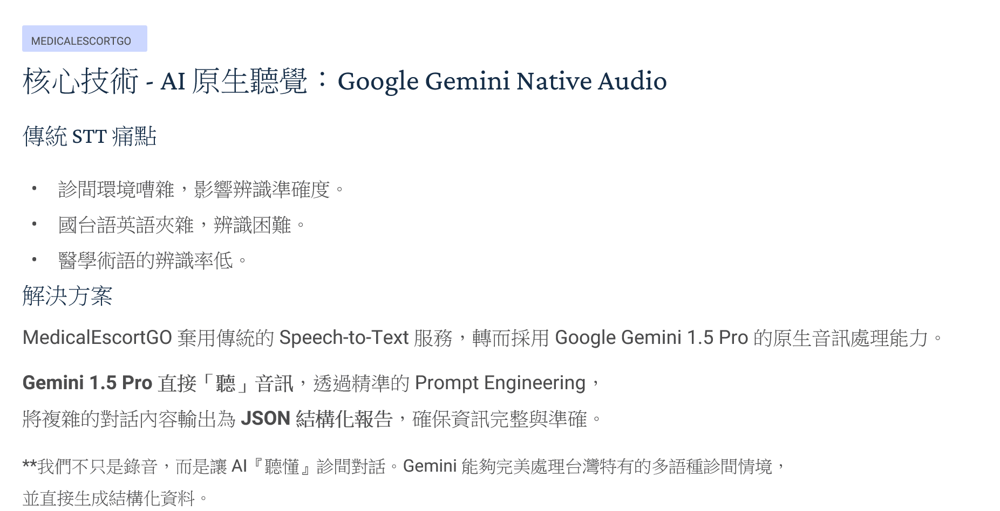
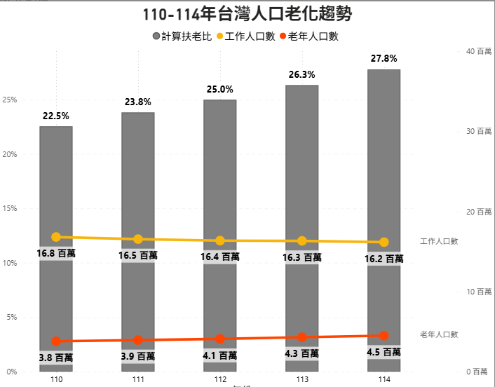

# MedicalEscortGO-Showcase
# 🏥 就醫陪同安心GO (MedicalEscortGO)

> **專為高齡就醫設計的智能陪診預約平台**
> 結合 AI 原生語音解析技術，打破醫療溝通障礙，並透過嚴謹的業務邏輯保障醫、患、陪三方權益。

---

### 📑 專案深度解析簡報 (PPT)
> 💡 **提示**：點擊下方連結，即可直接於瀏覽器內觀看完整專案架構與開發思維簡報。

**👉 [📥 點擊觀看：就醫陪同安心GO 完整專案簡報 (PDF)](https://github.com/yunne-tech/MedicalEscortGO-Showcase/blob/main/MedicalEscortGOPlatform.pdf)**

---

## 🚀 專案亮點 (Highlights)

* **AI 原生聽覺技術**：採用 **Gemini 1.5 Pro** 原生音訊處理，精準解析國、台、英多語混雜診間對話，並輸出 JSON 結構化報告。
* **高內聚低耦合架構**：後端採用 **Python Flask Blueprint** 設計，清晰隔離「使用者、陪診員、管理端」邏輯。
* **嚴謹預約控制**：實作排程防撞機制、併發控制與動態退費風控策略。

---

## 🛠 技術棧 (Tech Stack)

* **Frontend**: HTML5, CSS3, JavaScript (手工打造卡片式介面與微陰影設計)。
* **Backend**: Python Flask (Blueprint 模組化開發)。
* **Database**: SQLite (Zero-Config 高效部署)。
* **Data Analytics**: Power BI (營運指標視覺化分析)。

---

## 📊 系統架構與業務流程

本系統涵蓋「預約者、陪診員、平台端」三方實體之複雜關聯與自動化流轉。

  
*(💡 點擊此處查看 [Whimsical 高畫質互動式心智圖](https://whimsical.com/web-P5xQPEYEEU9GR2dnYufhHp))*

---

## 💡 技術挑戰與解法 (Technical Highlights)

### 1. 三方權限隔離與角色存取控制 (RBAC)
* **挑戰**：多角色併行，需防止非授權存取敏感營運報表。
* **解法**：運用 Flask Blueprint 實作邏輯隔離，並透過自定義裝飾器 (Decorators) 確保僅管理員能進入風控中心。

### 2. 預約防衝突機制 (Collision Prevention)
* **挑戰**：醫療服務具排他性，需確保單一陪診員時段絕不重疊。
* **解法**：在資料庫層級實作時段檢查，自動阻斷已過期時段及重疊下單之行為。

### 3. 動態風控退費邏輯
* **挑戰**：平衡陪診員排班成本與預約者取消之彈性。
* **解法**：實作「3 小時門檻規則」，針對服務前 3 小時內取消之已媒合訂單，系統自動扣除 30% 違約金。

---

## 🤖 核心技術：破除醫療語言藩籬的 AI 實作

針對診間嘈雜、醫學術語辨識率低的痛點，直接串接 **Gemini 1.5 Pro 原生音訊 API**。

* **多語辨識**：精準捕捉國台英夾雜對話。
* **結構化萃取**：強制輸出 JSON，讓非結構化語音直接轉化為可寫入資料庫的高質量數據。

---

## 📈 營運數據分析 (Power BI)

透過介接 SQLite 資料庫生成視覺化儀表板，監控訂單轉換率、熱門時段與使用者成長趨勢。

---

> 🔒 **Security Note**: 
> 為保護核心商業邏輯（包含風控演算法與資料庫細節），**後端 Python 原始碼已獨立存放於 Private Repository**。十分樂意於面試時透過螢幕分享展示完整代碼細節。
